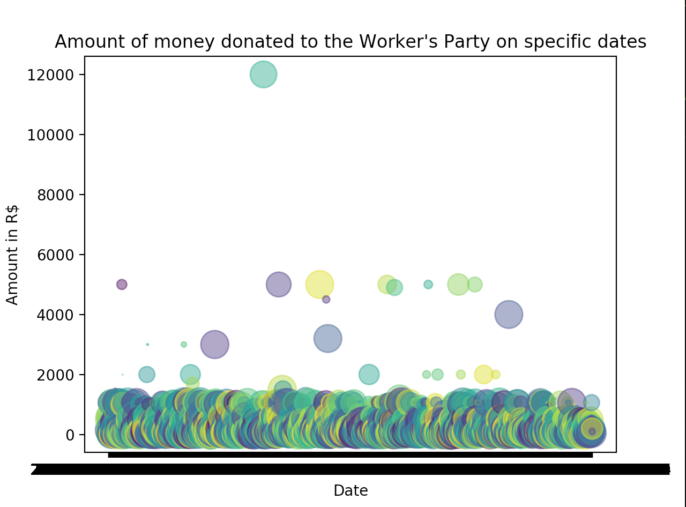

# Chocolate Baton
> This project is inspired on the project [Serenata de Amor](https://serenata.ai/en) and aims to use artificial intelligence for social control of public donations done by natural persons in Brazil.

### Analysis of Political Campaign Donations
The main objective of this project is to trace public donations back to their donors and estabilish a graph of possible relationships, being aware of the [six-degrees-of-separation problem](https://www.researchgate.net/publication/255614427_Six_Degrees_of_Separation_in_Online_Society) so to find possible frauds.

### Worker's Party
To analize the donations received by the Worker's party, we are using the public collected data given on the portal [Haddad President](https://haddadpresidente.com.br/doe/).

- [ ] Double-check CPF (social number) and link to people
- [ ] Gather natural language information for identification of group categories
- [ ] Estabilish graph of mutual relationships
- [ ] Identify patterns in data

### Social Liberal Party
- TODO

### Disclaimer
All information used by this project is of **public domain** and is protected by the law of transparency of public information matters in Brazil.

### Help
Pull requests are welcome
